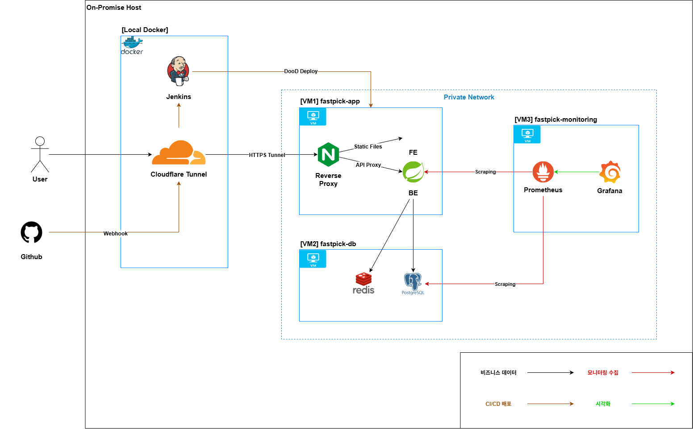

# 🏗️ FastPick Infrastructure

FastPick 프로젝트는 대규모 트래픽 환경에서의 성능 병목을 재현하고 분석하기 위해
각 역할을 분리한 인프라 구조로 설계되었습니다.

부하 테스트, 애플리케이션, 데이터베이스, 모니터링 환경을 독립적으로 구성하여
자원 간섭을 최소화하고 성능 지표의 신뢰도를 확보하는 데 초점을 맞췄습니다.

---

## 🧩 인프라 구성 개요

### 전체 구조 다이어그램



---

### 상세 구조

```text
PC
 ├─ Jenkins (CI)
 └─ K6 (Load Test)

VM1
 └─ Nginx + Application Server

VM2
 └─ PostgreSQL + Redis

VM3
 └─ Prometheus + Grafana
```

> - 각 구성 요소는 Docker 기반으로 실행되며, 역할 단위로 분리된 환경에서 독립적으로 배포 및 운영됩니다.
> - VM은 로컬 가상 머신 환경에서 구성되었습니다.

---

### 🖥️ CI 환경 (PC)

#### pc-jenkins/

```text
pc-jenkins/
- .env
- docker-compose.yml
```

**역할**

- Jenkins를 Docker로 구성한 CI 환경
- 애플리케이션 빌드, 테스트, 배포 자동화 수행

**설계 의도**

- CI 환경을 서비스 VM과 분리하여 빌드 작업이 성능 실험에 영향을 주지 않도록 설계
- 로컬 환경에서도 재현 가능한 CI 파이프라인 구성

### 🧪 부하 테스트 환경 (PC)

#### performance-test/

```text
performance-test/
- scripts/
  - coupon-issue-test.js
  - coupon-search-test.js
  - users.csv
```

**역할**

- K6 기반 부하 테스트 실행
- 쿠폰 조회 및 발급 시나리오에 대한 외부 트래픽 생성

**설계 의도**

- 애플리케이션 서버와 분리된 외부 부하 발생기 구성
- 네트워크 경로를 분리하여 병목 구간을 명확히 관측

### 🚀 애플리케이션 서버 (VM1)

#### vm1-app/

```text
vm1-app/
- nginx/conf.d/default.conf
- .env
- docker-compose.yml
```

**역할**

- Nginx Reverse Proxy
- Spring Boot 기반 애플리케이션 서버 실행

**설계 의도**

- 트래픽 진입 지점과 애플리케이션 로직 분리
- Reverse Proxy 설정 변경과 애플리케이션 배포 분리
- 단일 서버 환경에서의 처리 한계 및 병목 지점 명확화

### 🗄️ 데이터베이스 서버 (VM2)

#### vm2-db/

```text
vm2-db/
- .env
- docker-compose.yml
```

**역할**

- PostgreSQL (데이터베이스)
- Redis (캐시 및 동시성 제어)

**설계 의도**

- DB 자원을 애플리케이션 서버와 분리하여 CPU, I/O 경합 최소화
- 동시성 제어 및 성능 실험 결과의 신뢰도 확보

### 📊 모니터링 서버 (VM3)

#### vm3-monitoring/

```text
vm3-monitoring/
- prometheus/
  - prometheus.yml
- .env
- docker-compose.yml
```

**역할**

- Prometheus: 메트릭 수집
- Grafana: 메트릭 시각화

**설계 의도**

- 모니터링 환경을 서비스 서버와 분리하여 성능 측정 시 오버헤드 제거
- CPU, 메모리, 커넥션, Active Session 지표 실시간 분석

---

## 🎯 인프라 설계 핵심 포인트

- 역할 단위 VM 분리
  - 부하 테스트 / 애플리케이션 / DB / 모니터링 독립 구성
- 자원 간섭 최소화
  - 성능 병목 원인을 명확히 관측 가능
- 재현 가능한 실험 환경
  - 동일한 인프라 구성으로 반복 테스트 가능
- 단일 서버 기반 병목 관찰에 초점을 둔 구조

---

## 🧪 이 인프라 환경에서 검증된 실험

본 인프라 구성은 아래 백엔드 성능 실험을 재현하고
지표를 검증하기 위해 사용되었습니다.

- [대규모 데이터 조회 성능 튜닝](https://www.notion.so/2fc55588581980c3bebee8aa571b661e?source=copy_link)
- [실시간 쿠폰 발급 동시성 제어](https://www.notion.so/2fc55588581980d4b637f5ea13085351?source=copy_link)

---

## 🔗 관련 리포지토리

> - [FastPick BE](https://github.com/maximum-zero/fastpick-be)
> - [FastPick FE](https://github.com/maximum-zero/fastpick-fe)
